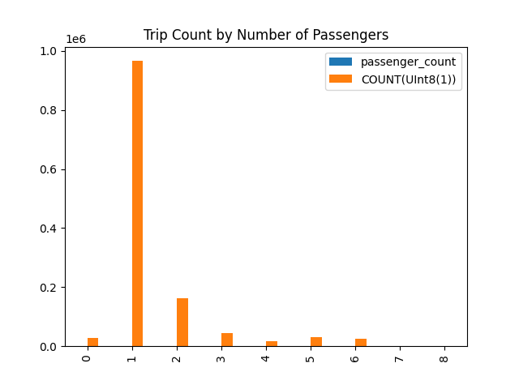

<!---
  Licensed to the Apache Software Foundation (ASF) under one
  or more contributor license agreements.  See the NOTICE file
  distributed with this work for additional information
  regarding copyright ownership.  The ASF licenses this file
  to you under the Apache License, Version 2.0 (the
  "License"); you may not use this file except in compliance
  with the License.  You may obtain a copy of the License at

    http://www.apache.org/licenses/LICENSE-2.0

  Unless required by applicable law or agreed to in writing,
  software distributed under the License is distributed on an
  "AS IS" BASIS, WITHOUT WARRANTIES OR CONDITIONS OF ANY
  KIND, either express or implied.  See the License for the
  specific language governing permissions and limitations
  under the License.
-->

# DataFusion in Python

[](https://github.com/apache/datafusion-python/actions/workflows/test.yaml)
[](https://github.com/apache/datafusion-python/actions/workflows/build.yml)

This is a Python library that binds to [Apache Arrow](https://arrow.apache.org/) in-memory query engine [DataFusion](https://github.com/apache/datafusion).

DataFusion's Python bindings can be used as a foundation for building new data systems in Python. Here are some examples:

- [Dask SQL](https://github.com/dask-contrib/dask-sql) uses DataFusion's Python bindings for SQL parsing, query
  planning, and logical plan optimizations, and then transpiles the logical plan to Dask operations for execution.
- [DataFusion Ballista](https://github.com/apache/datafusion-ballista) is a distributed SQL query engine that extends
  DataFusion's Python bindings for distributed use cases.

It is also possible to use these Python bindings directly for DataFrame and SQL operations, but you may find that
[Polars](http://pola.rs/) and [DuckDB](http://www.duckdb.org/) are more suitable for this use case, since they have
more of an end-user focus and are more actively maintained than these Python bindings.

## Features

- Execute queries using SQL or DataFrames against CSV, Parquet, and JSON data sources.
- Queries are optimized using DataFusion's query optimizer.
- Execute user-defined Python code from SQL.
- Exchange data with Pandas and other DataFrame libraries that support PyArrow.
- Serialize and deserialize query plans in Substrait format.
- Experimental support for transpiling SQL queries to DataFrame calls with Polars, Pandas, and cuDF.

## Example Usage

The following example demonstrates running a SQL query against a Parquet file using DataFusion, storing the results
in a Pandas DataFrame, and then plotting a chart.

The Parquet file used in this example can be downloaded from the following page:

- https://www.nyc.gov/site/tlc/about/tlc-trip-record-data.page

```python
from datafusion import SessionContext

# Create a DataFusion context
ctx = SessionContext()

# Register table with context
ctx.register_parquet('taxi', 'yellow_tripdata_2021-01.parquet')

# Execute SQL
df = ctx.sql("select passenger_count, count(*) "
             "from taxi "
             "where passenger_count is not null "
             "group by passenger_count "
             "order by passenger_count")

# convert to Pandas
pandas_df = df.to_pandas()

# create a chart
fig = pandas_df.plot(kind="bar", title="Trip Count by Number of Passengers").get_figure()
fig.savefig('chart.png')
```

This produces the following chart:



## Configuration

It is possible to configure runtime (memory and disk settings) and configuration settings when creating a context.

```python
runtime = (
    RuntimeConfig()
    .with_disk_manager_os()
    .with_fair_spill_pool(10000000)
)
config = (
    SessionConfig()
    .with_create_default_catalog_and_schema(True)
    .with_default_catalog_and_schema("foo", "bar")
    .with_target_partitions(8)
    .with_information_schema(True)
    .with_repartition_joins(False)
    .with_repartition_aggregations(False)
    .with_repartition_windows(False)
    .with_parquet_pruning(False)
    .set("datafusion.execution.parquet.pushdown_filters", "true")
)
ctx = SessionContext(config, runtime)
```

Refer to the [API documentation](https://arrow.apache.org/datafusion-python/#api-reference) for more information.

Printing the context will show the current configuration settings.

```python
print(ctx)
```

## More Examples

See [examples](examples/README.md) for more information.

### Executing Queries with DataFusion

- [Query a Parquet file using SQL](https://github.com/apache/datafusion-python/blob/main/examples/sql-parquet.py)
- [Query a Parquet file using the DataFrame API](https://github.com/apache/datafusion-python/blob/main/examples/dataframe-parquet.py)
- [Run a SQL query and store the results in a Pandas DataFrame](https://github.com/apache/datafusion-python/blob/main/examples/sql-to-pandas.py)
- [Run a SQL query with a Python user-defined function (UDF)](https://github.com/apache/datafusion-python/blob/main/examples/sql-using-python-udf.py)
- [Run a SQL query with a Python user-defined aggregation function (UDAF)](https://github.com/apache/datafusion-python/blob/main/examples/sql-using-python-udaf.py)
- [Query PyArrow Data](https://github.com/apache/datafusion-python/blob/main/examples/query-pyarrow-data.py)
- [Create dataframe](https://github.com/apache/datafusion-python/blob/main/examples/import.py)
- [Export dataframe](https://github.com/apache/datafusion-python/blob/main/examples/export.py)

### Running User-Defined Python Code

- [Register a Python UDF with DataFusion](https://github.com/apache/datafusion-python/blob/main/examples/python-udf.py)
- [Register a Python UDAF with DataFusion](https://github.com/apache/datafusion-python/blob/main/examples/python-udaf.py)

### Substrait Support

- [Serialize query plans using Substrait](https://github.com/apache/datafusion-python/blob/main/examples/substrait.py)

## How to install (from pip)

### Pip

```bash
pip install datafusion
# or
python -m pip install datafusion
```

### Conda

```bash
conda install -c conda-forge datafusion
```

You can verify the installation by running:

```python
>>> import datafusion
>>> datafusion.__version__
'0.6.0'
```

## How to develop

This assumes that you have rust and cargo installed. We use the workflow recommended by [pyo3](https://github.com/PyO3/pyo3) and [maturin](https://github.com/PyO3/maturin).

The Maturin tools used in this workflow can be installed either via Conda or Pip. Both approaches should offer the same experience. Multiple approaches are only offered to appease developer preference. Bootstrapping for both Conda and Pip are as follows.

Bootstrap (Conda):

```bash
# fetch this repo
git clone git@github.com:apache/datafusion-python.git
# create the conda environment for dev
conda env create -f ./conda/environments/datafusion-dev.yaml -n datafusion-dev
# activate the conda environment
conda activate datafusion-dev
```

Bootstrap (Pip):

```bash
# fetch this repo
git clone git@github.com:apache/datafusion-python.git
# prepare development environment (used to build wheel / install in development)
python3 -m venv venv
# activate the venv
source venv/bin/activate
# update pip itself if necessary
python -m pip install -U pip
# install dependencies (for Python 3.8+)
python -m pip install -r requirements.in
```

The tests rely on test data in git submodules.

```bash
git submodule init
git submodule update
```

Whenever rust code changes (your changes or via `git pull`):

```bash
# make sure you activate the venv using "source venv/bin/activate" first
maturin develop
python -m pytest
```

### Running & Installing pre-commit hooks

arrow-datafusion-python takes advantage of [pre-commit](https://pre-commit.com/) to assist developers with code linting to help reduce
the number of commits that ultimately fail in CI due to linter errors. Using the pre-commit hooks is optional for the
developer but certainly helpful for keeping PRs clean and concise.

Our pre-commit hooks can be installed by running `pre-commit install`, which will install the configurations in
your ARROW_DATAFUSION_PYTHON_ROOT/.github directory and run each time you perform a commit, failing to complete
the commit if an offending lint is found allowing you to make changes locally before pushing.

The pre-commit hooks can also be run adhoc without installing them by simply running `pre-commit run --all-files`

## Running linters without using pre-commit

There are scripts in `ci/scripts` for running Rust and Python linters.

```shell
./ci/scripts/python_lint.sh
./ci/scripts/rust_clippy.sh
./ci/scripts/rust_fmt.sh
./ci/scripts/rust_toml_fmt.sh
```

## How to update dependencies

To change test dependencies, change the `requirements.in` and run

```bash
# install pip-tools (this can be done only once), also consider running in venv
python -m pip install pip-tools
python -m piptools compile --generate-hashes -o requirements-310.txt
```

To update dependencies, run with `-U`

```bash
python -m piptools compile -U --generate-hashes -o requirements-310.txt
```

More details [here](https://github.com/jazzband/pip-tools)
