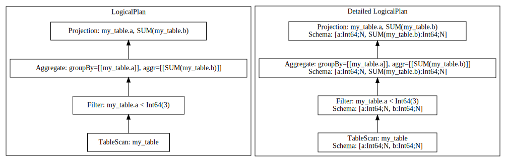

<!---
  Licensed to the Apache Software Foundation (ASF) under one
  or more contributor license agreements.  See the NOTICE file
  distributed with this work for additional information
  regarding copyright ownership.  The ASF licenses this file
  to you under the Apache License, Version 2.0 (the
  "License"); you may not use this file except in compliance
  with the License.  You may obtain a copy of the License at
    http://www.apache.org/licenses/LICENSE-2.0
  Unless required by applicable law or agreed to in writing,
  software distributed under the License is distributed on an
  "AS IS" BASIS, WITHOUT WARRANTIES OR CONDITIONS OF ANY
  KIND, either express or implied.  See the License for the
  specific language governing permissions and limitations
  under the License.
-->

# DataFusion Query Plans

DataFusion's `DataFrame` is a wrapper around a query plan. In this chapter we will learn how to view
logical and physical query plans for DataFrames.

## Sample Data

Let's go ahead and create a simple DataFrame. You can do this in the Python shell or in a notebook.

```python
from datafusion import SessionContext

ctx = SessionContext()

df = ctx.from_pydict({"a": [1, 2, 3, 1], "b": [4, 5, 6, 7]}, name="my_table")
```

## Logical Plan

Next, let's look at the logical plan for this dataframe.

```python
>>> df.logical_plan()
TableScan: my_table
```

The logical plan here consists of a single `TableScan` operator. Let's make a more interesting plan by creating a new
`DataFrame` representing an aggregate query with a filter.

```python
>>> df = ctx.sql("SELECT a, sum(b) FROM my_table WHERE a < 3 GROUP BY a")
```

When we view the plan for this `DataFrame` we can see that there are now four operators in the plan, each
representing a logical transformation of the data. We start with a `TableScan` to read the data, followed by
a `Filter` to filter out rows that do not match the filter expression, then an `Aggregate` is performed. Finally,
a `Projection` is applied to ensure that the order of the final columns matches the `SELECT` part of the SQL query.

```python
>>> df.logical_plan()
Projection: my_table.a, SUM(my_table.b)
  Aggregate: groupBy=[[my_table.a]], aggr=[[SUM(my_table.b)]]
    Filter: my_table.a < Int64(3)
      TableScan: my_table
```

## Optimized Logical Plan

DataFusion has a powerful query optimizer which will rewrite query plans to make them more efficient before they are
executed. We can view the output of the optimized by viewint the optimized logical plan.

```python
>>> df.optimized_logical_plan()
Aggregate: groupBy=[[my_table.a]], aggr=[[SUM(my_table.b)]]
  Filter: my_table.a < Int64(3)
    TableScan: my_table projection=[a, b]
```

We can see that there are two key differences compared to the unoptimized logical plan:

- The `Projection` has been removed because it was redundant in this case (the output of the `Aggregatge` plan
  already had the columns in the correct order).
- The `TableScan` now has a projection pushed down so that it only reads the columns required to be able to execute
  the query. In this case the table only has two columns and we referenced them both in the query, but this optimization
  can be very effective in real-world queries against large tables.

## Physical Plan

Logical plans provide a representation of "what" the query should do it. Physical plans explain "how" the query
should be executed.

We can view the physical plan (also known as an execution plan) using the `execution_plan` method.

```python
>>> df.execution_plan()
AggregateExec: mode=FinalPartitioned, gby=[a@0 as a], aggr=[SUM(my_table.b)]
  CoalesceBatchesExec: target_batch_size=8192
    RepartitionExec: partitioning=Hash([Column { name: "a", index: 0 }], 48), input_partitions=48
      AggregateExec: mode=Partial, gby=[a@0 as a], aggr=[SUM(my_table.b)]
        CoalesceBatchesExec: target_batch_size=8192
          FilterExec: a@0 < 3
            RepartitionExec: partitioning=RoundRobinBatch(48), input_partitions=1
              MemoryExec: partitions=1, partition_sizes=[1]
```

The `TableScan` has now been replaced by a more specific `MemoryExec` for scanning the in-memory data. If we were
querying a CSV file on disk then we would expect to see a `CsvExec` instead.

This plan has additional operators that were not in the logical plan:

- `RepartionExec` has been added so that the data can be split into partitions and processed in parallel using
  multiple cores.
- `CoalesceBatchesExec` will combine small batches into larger batches to ensure that processing remains efficient.

The `Aggregate` operator now appears twice. This is because aggregates are performed in a two step process. Data is
aggregated within each partition in parallel and then those results (which could contain duplicate grouping keys) are
combined and the aggregate operations is applied again.

## Creating Query Plan Diagrams

DataFusion supports generating query plan diagrams in [DOT format](<https://en.wikipedia.org/wiki/DOT_(graph_description_language)>).

DOT is a language for describing graphs and there are open source tools such as GraphViz that can render diagrams
from DOT files.

We can use the following code to generate a DOT file for a logical query plan.

```python
>>> diagram = df.logical_plan().display_graphviz()
>>> with open('plan.dot', 'w') as f:
>>>   f.write(diagram)
```

If we view the view, we will see the following content.

```
// Begin DataFusion GraphViz Plan (see https://graphviz.org)
digraph {
  subgraph cluster_1
  {
    graph[label="LogicalPlan"]
    2[shape=box label="Projection: my_table.a, SUM(my_table.b)"]
    3[shape=box label="Aggregate: groupBy=[[my_table.a]], aggr=[[SUM(my_table.b)]]"]
    2 -> 3 [arrowhead=none, arrowtail=normal, dir=back]
    4[shape=box label="Filter: my_table.a < Int64(3)"]
    3 -> 4 [arrowhead=none, arrowtail=normal, dir=back]
    5[shape=box label="TableScan: my_table"]
    4 -> 5 [arrowhead=none, arrowtail=normal, dir=back]
  }
  subgraph cluster_6
  {
    graph[label="Detailed LogicalPlan"]
    7[shape=box label="Projection: my_table.a, SUM(my_table.b)\nSchema: [a:Int64;N, SUM(my_table.b):Int64;N]"]
    8[shape=box label="Aggregate: groupBy=[[my_table.a]], aggr=[[SUM(my_table.b)]]\nSchema: [a:Int64;N, SUM(my_table.b):Int64;N]"]
    7 -> 8 [arrowhead=none, arrowtail=normal, dir=back]
    9[shape=box label="Filter: my_table.a < Int64(3)\nSchema: [a:Int64;N, b:Int64;N]"]
    8 -> 9 [arrowhead=none, arrowtail=normal, dir=back]
    10[shape=box label="TableScan: my_table\nSchema: [a:Int64;N, b:Int64;N]"]
    9 -> 10 [arrowhead=none, arrowtail=normal, dir=back]
  }
}
// End DataFusion GraphViz Plan
```

We can use GraphViz from the command-line to convert this DOT file into an image.

```bash
dot -Tsvg plan.dot > plan.svg
```

This generates the following diagram:


