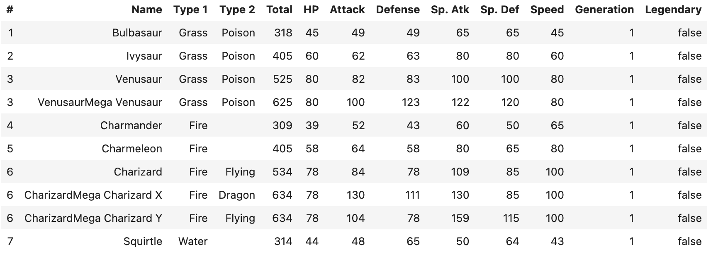

.. Licensed to the Apache Software Foundation (ASF) under one
.. or more contributor license agreements.  See the NOTICE file
.. distributed with this work for additional information
.. regarding copyright ownership.  The ASF licenses this file
.. to you under the Apache License, Version 2.0 (the
.. "License"); you may not use this file except in compliance
.. with the License.  You may obtain a copy of the License at

..   http://www.apache.org/licenses/LICENSE-2.0

.. Unless required by applicable law or agreed to in writing,
.. software distributed under the License is distributed on an
.. "AS IS" BASIS, WITHOUT WARRANTIES OR CONDITIONS OF ANY
.. KIND, either express or implied.  See the License for the
.. specific language governing permissions and limitations
.. under the License.

.. _guide:

Introduction
============

Welcome to the User Guide for the Python bindings of Arrow DataFusion. This guide aims to provide an introduction to
DataFusion through various examples and highlight the most effective ways of using it.

Installation
------------

DataFusion is a Python library and, as such, can be installed via pip from `PyPI <https://pypi.org/project/datafusion>`__.

.. code-block:: shell

    pip install datafusion

You can verify the installation by running:

.. ipython:: python

    import datafusion
    datafusion.__version__

In this documentation we will also show some examples for how DataFusion integrates
with Jupyter notebooks. To install and start a Jupyter labs session use

.. code-block:: shell

    pip install jupyterlab
    jupyter lab

To demonstrate working with DataFusion, we need a data source. Later in the tutorial we will show
options for data sources. For our first example, we demonstrate using a Pokemon dataset that you
can download
`here <https://gist.githubusercontent.com/ritchie46/cac6b337ea52281aa23c049250a4ff03/raw/89a957ff3919d90e6ef2d34235e6bf22304f3366/pokemon.csv>`_.

With that file in place you can use the following python example to view the DataFrame in
DataFusion.

.. ipython:: python

    from datafusion import SessionContext

    ctx = SessionContext()

    df = ctx.read_csv("pokemon.csv")

    df.show()

If you are working in a Jupyter notebook, you can also use the following to give you a table
display that may be easier to read.

.. code-block:: shell

    display(df)

